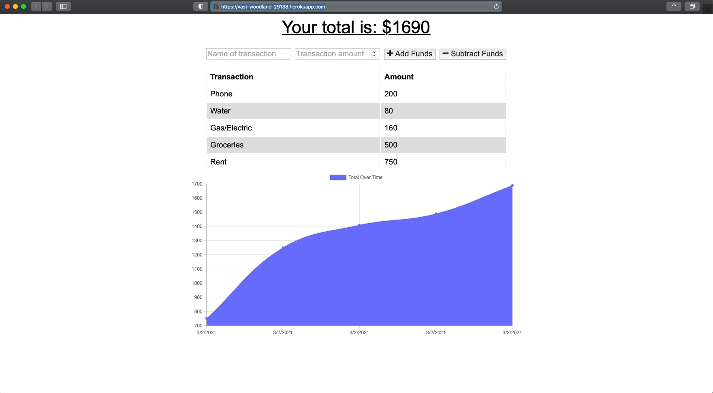

# Budget Tracker
This site was developed with the intention of creating a budget tracker application that allows offline/online access and functionality. The applications allows users to add expenses and deposits to their budget with or without a connection. When entering transactions offline, totals are populated when brought back online. 

## Motivation
The motivation behind this project was to create an application utilizing MongoDB, indexDB, Node, Express, and Morgan, which will deploy to Heroku, while also implementing the MVC design pattern.

## Tech/Framework Used
* Node.js
* Express
* MongoDB
* Mongoose
* Morgan
* Compression
* Lite-server
* HTML/CSS
* Bootstrap
* Javascript
* JSON
* Heroku
* Built with Visual Code Studio

## Code Example
Here is an example of the "Budget Tracker" application:

## Features
Offline Functionality:
* Enter deposits offline
* Enter expenses offline

When brought back online:

* Offline entries should be added to tracker

## Installation
If choosing to run locally, clone this repository to your machine or download zip file.

## Usage
After the repository has been cloned, use terminal to change directories into "Budget-Tracker" directory. Run the command "npm install" and then "node server.js", and then view application on http://localhost:3000/. Otherwise, the app can be accessed live at the Heroku link provided below. 

## License 

> You can reference the full license [here](https://github.com/Picke1id/Budget-Tracker/blob/master/LICENSE).

This project is licensed under the terms of the MIT license.

## Link
* Heroku Deployment: (https://vast-woodland-29138.herokuapp.com)
